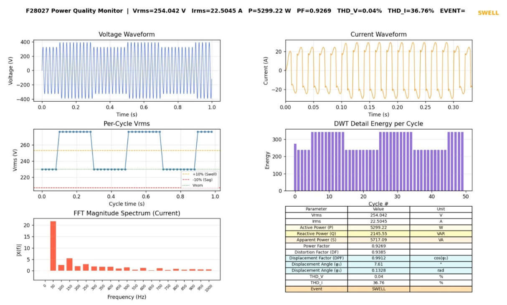

<h1 align="center">Power Quality Analyzer — TMS320F28027F</h1>

<p align="center">
Real-time power quality monitoring system built on the TI C2000 Piccolo DSP. Measures and reports key power quality parameters per IEC standards, detects voltage disturbance events, and streams results to a live Python dashboard over UART.
</p>

---

## Features

- RMS voltage and current measurement (per-cycle and aggregate)
- Active (P), Reactive (Q), and Apparent (S) power computation
- Power Factor (PF), Displacement Power Factor (DPF), and Distortion Factor (DF)
- Total Harmonic Distortion for voltage (THD_V) and current (THD_I) via FFT algorithm
- Harmonic spectrum up to the 20th order via FFT (21 bins at 50 Hz resolution)
- Voltage event detection: Sag (<90% Vnom) and Swell (>110% Vnom)
- DWT-based transient energy analysis per cycle using Daubechies-4 wavelet
- UART output at 115200 baud feeding a live 6-panel Python dashboard

---

## Repository Structure

```
power-quality-analyzer/
├── firmware/
│   ├── pq_normal.c       # MATLAB-generated normal condition data
│   ├── pq_sag.c          # MATLAB-generated voltage sag data
│   ├── pq_swell.c        # MATLAB-generated voltage swell data
│   └── pq_realreal.c     # Real data captured with PicoScope
├── visualization/
│   └── pq_receiver.py    # Python UART receiver and 6-panel live plotter
├── matlab/
│   ├── pqa_normal.slx    # Simulink model used to generate test CSV data
│   ├── pqa_sag.slx
│   └── pqa_swell.slx
├── data/
│   ├── pq_normal.csv
│   ├── pq_sag.csv
│   ├── pq_swell.csv
│   ├── picoscope_current.csv
│   └── picoscope_voltage.csv
├── assets/
│   ├── block_diagram.png
│   ├── signal_conditioning_ckt_LTspice.png
│   ├── signal_conditioning_ckt_perfboard1.jpeg
│   └── signal_conditioning_ckt_perfboard2.jpeg
├── results/
│   ├── picoscope_dashboard.png
│   ├── matlab_normal_dashboard.jpg
│   ├── matlab_sag_dashboard.jpg
│   └── matlab_swell_dashboard.png
└── README.md
```

---

## Hardware

| Component | Part |
|---|---|
| MCU | TMS320F28027F (C2000 Piccolo LaunchPad) |
| Voltage sensor | LEM LV25-P (Hall-effect) |
| Current sensor | LEM LA55-P (Hall-effect) |
| Op-amp | LM358 (non-inverting summing amplifier, 1.65V DC offset) |
| Power supply | 12-0-12V AC transformer + IC 7812/7912/7905 regulators |
| Anti-aliasing filter | RC LPF — 6.8 kΩ + 22 nF (~1 kHz cutoff) |

---

## Signal Processing

| Parameter | Method |
|---|---|
| RMS voltage/current | Per-cycle RMS over 40 samples (Fs = 2 kHz, F0 = 50 Hz) |
| THD | FFT algorithm — harmonics 2nd through 20th |
| Harmonic spectrum | FFT on one cycle (40 samples → 21 bins) |
| Transient detection | Daubechies-4 DWT detail energy per cycle |
| Event detection | Sag: Vrms < 90% Vnom; Swell: Vrms > 110% Vnom |

Processing is done per-cycle (40 samples) to fit within the F28027F's ~6 KB data RAM limit.

---

## Firmware Files

All four `.c` files are standalone — each contains embedded data arrays and requires no external CSV or header file beyond `DSP28x_Project.h`.

| File | Data source | Condition |
|---|---|---|
| `pq_normal.c` | MATLAB Simulink | Clean 50 Hz sinusoid |
| `pq_sag.c` | MATLAB Simulink | Voltage sag (cycles 10–30) |
| `pq_swell.c` | MATLAB Simulink | Voltage swell (cycles 10–30) |
| `pq_realreal.c` | PicoScope (real mains) | Real-world waveform |

Each file outputs a 6-line UART frame per frame period:

```
CSV,<Vrms>,<Irms>,<THD_V>,<THD_I>,<P>,<PF>,<DF>,<DPF>,<EVENT>
VWAVE,<2000 voltage samples>
IWAVE,<2000 current samples>
VCYC,<50 per-cycle Vrms values>
DWT,<50 per-cycle detail energies>
FFT,<21 magnitude bins>
```

---

## CCS Setup

1. Create a new CCS project targeting TMS320F28027F
2. Add one `.c` file from `firmware/` (only one at a time)
3. Link `DSP28x_Project.h` from your C2000Ware or controlSUITE installation
4. Build and flash (or load to RAM for debug)
5. Open **View → Expressions**, add `pq_result` to the Watch Window
6. Open **Tools → Graph → Time/Frequency**:
   - Start Address: `v_data_ram`
   - Acquisition Buffer Size: `2000`
   - Sampling Rate: `2000`
   - DSP Data Type: `32-bit floating point`
7. Open **View → Terminal** at 115200 8N1 on your COM port

---

## Python Dashboard

### Requirements

```bash
pip install pyserial matplotlib
```

### Run

```bash
python pq_receiver.py --port COM4 --wait 30
```

Use `--loop` to continuously refresh as new frames arrive. On Linux, replace `COM4` with `/dev/ttyUSB0` or equivalent.

### Dashboard Panels

| Panel | Content |
|---|---|
| 1 | Full voltage waveform (2000 samples) |
| 2 | Current waveform (zoomed to first third) |
| 3 | Per-cycle Vrms with ±10% Vnom thresholds |
| 4 | DWT detail energy per cycle (transient indicator) |
| 5 | FFT magnitude spectrum (current harmonics) |
| 6 | PQ metrics table: Vrms, Irms, P, Q, S, PF, DF, DPF, φ₁, THD_V, THD_I, Event |

<p align="center">

</p>
